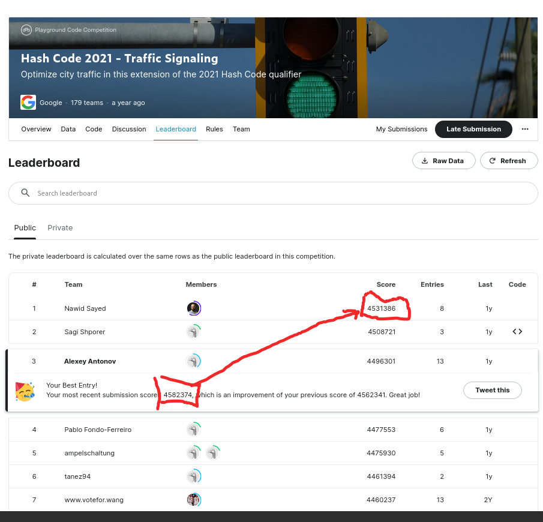

## Overview
This code is multi-GPU solver for traffic light scheduling problem offered at HashCode 2021 competition. 

## <a href="https://www.kaggle.com/competitions/hashcode-2021-oqr-extension" target="_blank">Kaggle extended version</a> of the Hash Code Online Qualifications 2021 problem. 

I was third in this <a href="https://www.kaggle.com/competitions/hashcode-2021-oqr-extension/leaderboard" target="_blank">competition</a>. However, this code is an improved multi-GPU version of my solver and it will by far surpass the winning solution.

## Compilation an usage

Installation requirements: cuda ,boost. Obviusly to run GPU solver you need to have GPU device better with memory at least 3 gigs.

Clone this repo, cd to the repo folder and compile the code by running in the command line:

>make

To run the solver on 1 gpu:
>./solver input/hashcode.in 1

To run the solver on multi-gpu:
>./solver input/hashcode.in 4

where 4 stands fot the number of gpu to be used (!attention: [0,1,2,3] gpus would be used)

Attention: if your GPU is old then you need to edit config_solver file:

size_of_threads_GPU  20000 (reduce this to 1000-4000 if you running out of cuda memory, it specifies the number of tested mutations per GPU in 1 round)

The output is saved to the folder "results" (specified in config_solver file).

## Problem overview
Given the description of a city plan and planned paths for all cars in that city,
optimize the schedule of trac lights to minimize the total amount of time spent in
trac, and help as many cars as possible reach their destination before a given deadline.

This problem is a combinatorial optimization problem. Top solutions at the competition all implement  hill climbing optimization techniques. For a given schedule change the order of traffic lights for two streets and, if improved , introduce this incremental change to the solution. 

## Baseline solution
The baseline solution was proposed by winning teams at the qualification round of HashCode 2021 and implements a very simple optimization principle which we refer further as First In First Green (FIFG) optimization. In this case traffic lights are scheduled in line with the first car coming to the junction. This principle allows us to get a solution with a score ~4 410 000 (4.4 M) on the scale of 0.2 seconds for the  Kaggle extended problem.

##  Winning solution of Kaggle extended round
<a href="https://www.kaggle.com/competitions/hashcode-2021-oqr-extension/discussion/243953" target="_blank">According to the winner post:</a> it  starts from a random 4.0M solution and iteratively swapped 2 random roads on a random intersection and kept the swap if the score is non-decreasing. It was implemented in a c++ script with a focus on performance, yielding a speed of around 600 swap evaluations per minute (single core,) or 10 swaps per second. The final score was achieved  after running the script for about 150h.

##  multi-GPU solver
Presented here version of the cuda/c++ code implements 2 strategies  (both FIFG and hill climbing) which increases both speed and efficiency. On modern GPU it achieved speed for evaluation of ~ 5 000 swaps in a second (so 500 times acceleration in comparison to the winning solution). 
Implementation of FIFG allows to start from a baseline solution (4.4 M) and achieve a winning score in less than 5 hours using 1 gpu. The table 1 below provides benchmark performance.

## Table 1:  performance benchmark

|  Method                  | Exec Time       | Score         | Surplus    |
|:------------------------:|:---------------:|:-------------:|:----------:|
| GPU solver  4gpu         | 48 hours        |   `4582000`     | 172K       | 
| GPU solver  1gpu         | 48 hours        |   `4562000`     | 152K       | 
| GPU solver  1gpu         | 4 hours         |   `4532000`     | 122K       |
| 1-best                   | 150 hours       |   `4531386`     | 121K       |
| 2-best                   | unknown         |   `4508721`     | 98K        |
| 3-best                   | 90 hours        |   `4496301`     | 86K        |
| 4-best                   | unknown         |   `4477553`     | 67K        |
| 10-best                  | unknown         |   `4426251`     | 16K        |
| BaseLine (FIFG)          | 0.1 second      |   `4410000`     | 0 K        | 

   
 
### Figure 1: Submission of the best solution , the score of the late submission is 4582374 which is by far exeeds the winning score 4531386

